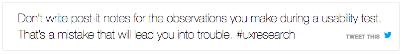

# remark-tweetthis

A plug-in for [gatsby-transformer-remark](https://github.com/gatsbyjs/gatsby/tree/master/packages/gatsby-transformer-remark)
that makes a paragraph of your Markdown text tweetable.

It turns this markdown syntax...

```markdown
[Don't write post-it notes for the observations you make during a usability test. That's a mistake that will lead you into trouble. #uxresearch][tweet]
```

into this tweetable snippet:



When a reader clicks on the text in the box or on "Tweet this", the text will be shared on Twitter [(click this link to see what will happen)](https://twitter.com/intent/tweet?url=https%3A%2F%2Fjustaskusers.com/affinity-diagrams-dont-scale/&text=Don%E2%80%99t%20write%20post-it%20notes%20for%20the%20observations%20you%20make%20during%20a%20usability%20test.%20That%E2%80%99s%20a%20mistake%20that%20will%20lead%20you%20into%20trouble.%20%23uxresearch&via=justaskusers).

## How to make it work

These are the steps that you need to get started:

### Install the plug-in

Edit the plugins section of gatsby-config.js, look for `gatsby-transformer-remark` and add
this plug-in to the list of transformers, like this:

```javascript
plugins: [
    {
        resolve: `gatsby-transformer-remark`,
        options: {
            plugins: [
                {
                    resolve: `remark-tweetthis`,
                    options: {
                        siteUrl: 'https://yourownsite.com',
                        tweetAs: 'yourtwitteruser'
                    },
                },
            ],
        },
    },
]
```

### Modify your markdown rendering class

Somewhere in your Gatsby-based site, you'll have a `blog-post.jsx` file with a line where you insert the rendered HTML
into the output, similar to this:

```jsx
<div dangerouslySetInnerHTML={{ __html: post.html }} />
```

Edit it like this:

```jsx
<div dangerouslySetInnerHTML={{ __html: post.html.replace(/PAGE_SLUG/gi, post.fields.slug) }} />
```

You may have to modify your GraphQL query accordingly so that you get `post.fields.slug` at all:

```GraphQL
query BlogPostBySlug($slug: String!) {
    site {
        siteMetadata {
            title
            author
        }
    }
    markdownRemark(fields: {slug: {eq: $slug } }) {
        id
        html
        fields {
            slug
        }
        frontmatter {
            title
            date(formatString: "MMMM DD, YYYY")
        }
    }
}
```

### Copy the CSS and the PNG icon file

Copy `tweetthis.css` and `twitterbird.png` into your web application. Edit `tweetthis.css` in two places so that it matches the URL of `twitterbird.png`:

```css
background: transparent url(/images/remark-tweetthis/twitterbird.png) no-repeat right top 8px;
```

